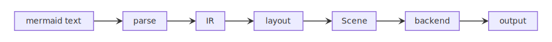
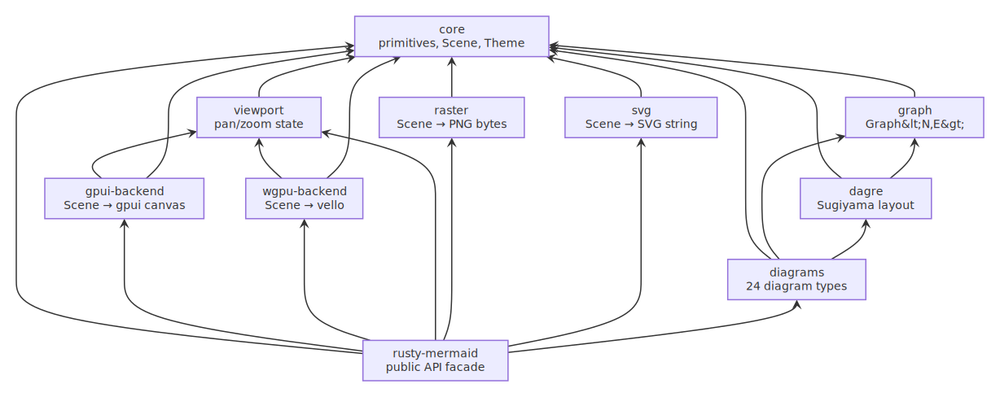
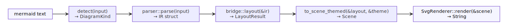
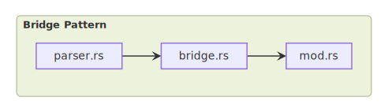
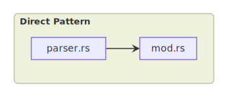
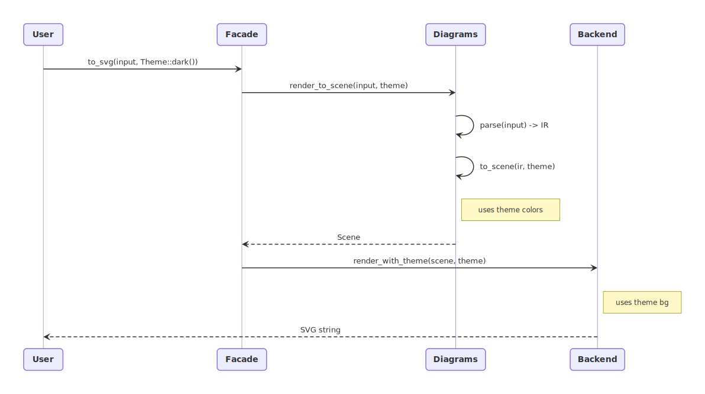

# rusty-mermaid Architecture

## 1. System Overview

rusty-mermaid is a pure-Rust port of [mermaid.js](https://mermaid.js.org/) and its layout engine [dagre](https://github.com/dagrejs/dagre). It parses mermaid diagram syntax and renders to multiple output formats: SVG, PNG (CPU), PNG (GPU via vello/wgpu), and native desktop (gpui/Zed).

**Core design principle:** `Scene` is the universal contract between layout and rendering. Every diagram type produces a `Scene` (a flat list of geometric primitives). Every backend consumes a `Scene`. The two halves never know about each other.



<details>
<summary>Mermaid source</summary>

```
flowchart LR
    A[mermaid text] --> B[parse] --> C[IR] --> D[layout] --> E[Scene] --> F[backend] --> G[output]
```

</details>

### Crate Dependency DAG



<details>
<summary>Mermaid source</summary>

```
graph BT
    core["core"]
    graph["graph"]
    dagre["dagre"]
    diagrams["diagrams"]
    svg["svg"]
    raster["raster"]
    viewport["viewport"]
    wgpu["wgpu-backend"]
    gpui["gpui-backend"]
    facade["rusty-mermaid"]

    dagre --> graph
    dagre --> core
    graph --> core
    diagrams --> dagre
    diagrams --> graph
    diagrams --> core
    svg --> core
    raster --> core
    viewport --> core
    wgpu --> core
    wgpu --> viewport
    gpui --> core
    gpui --> viewport
    facade --> diagrams
    facade --> svg
    facade --> raster
    facade --> viewport
    facade --> wgpu
    facade --> gpui
    facade --> core
```

</details>

## 2. Request Flow

What happens when a user calls `rusty_mermaid::to_svg(input)`:



<details>
<summary>Mermaid source</summary>

```
flowchart LR
    Input["mermaid text"] --> Detect["detect()"]
    Detect --> Parse["parse()"]
    Parse --> Layout["layout()"]
    Layout --> Build["to_scene_themed()"]
    Build --> Backend["render()"]
```

</details>

### Step by step

1. **Detection.** `detect(input)` scans the first non-empty, non-comment line for a keyword (`flowchart`, `stateDiagram`, `pie`, etc.) and returns the matching `DiagramKind` variant.

2. **Parsing.** The diagram module's `parser::parse(input)` converts mermaid text into a diagram-specific IR struct (e.g., `FlowDiagram`, `PieChart`, `SequenceDiagram`). The parser is a hand-written recursive descent parser -- no parser generator.

3. **Layout.** For graph-based diagrams, `bridge::layout(&ir)` builds a `Graph<NodeLabel, EdgeLabel>`, runs the dagre Sugiyama pipeline (rank assignment, crossing minimization, coordinate assignment), and produces a `LayoutResult` with positioned nodes and routed edges. Non-graph diagrams compute positions directly with custom layout logic.

4. **Scene building.** `to_scene_themed(&layout, &theme)` walks the positioned data and emits `Primitive` values (Rect, Path, Text, etc.) into a `Scene`. The Theme controls all colors, font sizes, and stroke widths -- no hardcoded values.

5. **Backend rendering.** The backend iterates `scene.elements()` and translates each `Primitive` to the output format. For SVG: XML string building. For raster: tiny-skia pixel drawing. For wgpu: vello scene commands. For gpui: canvas paint calls.

## 3. Crate Architecture

### core (`rusty-mermaid-core`)

The foundation. Defines the types that every other crate depends on.

- **Depends on:** nothing (leaf crate)
- **Exports:** `Scene`, `Primitive`, `Element`, `ElementId`, `Style`, `TextStyle`, `Theme`, `Color`, `Point`, `BBox`, `Direction`, `Shape`, `Renderer` trait, `CurveType`, `PathSegment`, `MarkerType`, `Transform`, `TextAnchor`, `FontWeight`, `TextMeasure` trait, `SimpleTextMeasure`, geometry utilities, marker shape data, font fallback, constants

### graph (`rusty-mermaid-graph`)

Directed multigraph with compound node hierarchy (subgraphs/clusters).

- **Depends on:** core
- **Exports:** `Graph<N, E>`, `NodeId`, `EdgeId`, `IdGen`, traversal algorithms (`bfs`, `dfs`, `topo_sort`, `postorder`)

### dagre (`rusty-mermaid-dagre`)

Rust port of the dagre.js Sugiyama layout algorithm. Converts a graph with label dimensions into positioned coordinates.

- **Depends on:** core, graph
- **Exports:** `DagreConfig` (alignment, ranker selection, spacing), `NodeLabel`, `EdgeLabel`, `LabelPos`, pipeline functions (rank, order, position, normalize, acyclic removal)
- **Pipeline:** acyclic → rank → normalize long edges → order (crossing reduction) → position (coordinate assignment)

### diagrams (`rusty-mermaid-diagrams`)

All 24 diagram types. Each is a Cargo feature that can be compiled independently.

- **Depends on:** core, graph, dagre
- **Exports:** `DiagramKind`, `detect()`, `render_to_scene()`, `render_to_scene_themed()`, `ParseError`, per-diagram modules
- **Diagram types:** flowchart, state, sequence, class, ER, requirement, pie, timeline, kanban, gantt, gitgraph, xychart, mindmap, sankey, packet, quadrant, venn, radar, user-journey, treeview, ishikawa, treemap, block, c4, architecture
- **Shared utilities:** `common/` module with error types, layout structs (`NodeLayout`, `EdgeLayout`), rendering helpers, style resolution, token processing

### svg (`rusty-mermaid-svg`)

Scene to SVG string conversion.

- **Depends on:** core
- **Exports:** `SvgRenderer`, `SvgConfig`, `SvgDocument`
- **Implements:** `Renderer` trait (`Output = String`)
- **Notable:** per-color marker `<defs>`, padding via translate group, theme-aware background rect

### raster (`rusty-mermaid-raster`)

Scene to PNG bytes via tiny-skia (CPU software rasterizer, no GPU required).

- **Depends on:** core
- **Exports:** `RasterRenderer`, `RasterConfig`
- **Implements:** `Renderer` trait (`Output = Vec<u8>`)
- **Notable:** configurable DPI scale, theme-driven background, embedded font rendering

### viewport (`rusty-mermaid-viewport`)

Shared pan/zoom state for interactive backends.

- **Depends on:** core
- **Exports:** `ViewportState` (offset, zoom, hovered element, selected elements), `ViewportAction`, coordinate transform functions (screen-to-scene, scene-to-screen)

### wgpu-backend (`rusty-mermaid-wgpu`)

Scene to GPU rendering via vello (WebGPU/Vulkan/Metal).

- **Depends on:** core, viewport
- **Exports:** `GpuRenderer` (reusable device/queue), `render()` (Scene + Theme + ViewportState -> vello::Scene), `render_to_png()` (headless GPU)
- **Notable:** single `GpuRenderer` instance avoids device-per-frame crash on macOS

### gpui-backend (`rusty-mermaid-gpui`)

Scene to Zed editor canvas element.

- **Depends on:** core, viewport
- **Exports:** `render_element()` (Scene -> gpui IntoElement), `paint_scene()` (low-level paint calls)
- **Notable:** uses `Rc<Scene>` to avoid deep copies per frame

### facade (`rusty-mermaid`)

Public API crate. Re-exports everything behind feature flags.

- **Depends on:** core, diagrams, and optionally svg, raster, viewport, wgpu, gpui
- **Exports:** `render()`, `to_svg()`, `to_svg_themed()`, `to_png()`, `to_png_themed()`, re-exports of core types
- **Feature flags:** `svg`, `raster`, `viewport`, `wgpu`, `gpui` -- each pulls in the corresponding backend crate

## 4. Diagram Module Patterns

### Bridge pattern (graph-based)

Used by diagrams that have nodes and edges laid out by dagre: **flowchart, state, class, ER, requirement, block, c4, architecture**.



<details>
<summary>Mermaid source</summary>

```
flowchart LR
    subgraph "Bridge Pattern"
        P["parser.rs"] --> B["bridge.rs"]
        B --> S["mod.rs"]
    end
```

</details>

File structure:
```
crates/diagrams/src/flowchart/
    mod.rs       -- to_scene_themed(): LayoutResult → Scene (emit primitives)
    parser.rs    -- parse(): &str → FlowDiagram (IR)
    bridge.rs    -- layout(): &FlowDiagram → LayoutResult (dagre pipeline)
    ir.rs        -- FlowDiagram, FlowVertex, FlowEdge, FlowSubGraph
```

The bridge translates between the diagram's domain model and dagre's generic `Graph<NodeLabel, EdgeLabel>`. It measures text to compute node dimensions, builds the graph, runs dagre, then reads back positioned coordinates into a `LayoutResult`.

### Direct pattern (non-graph)

Used by diagrams with custom layout logic: **pie, sequence, timeline, kanban, gantt, gitgraph, xychart, mindmap, sankey, packet, quadrant, venn, radar, journey, treeview, ishikawa, treemap**.



<details>
<summary>Mermaid source</summary>

```
flowchart LR
    subgraph "Direct Pattern"
        P["parser.rs"] --> S["mod.rs"]
    end
```

</details>

File structure:
```
crates/diagrams/src/pie/
    mod.rs       -- to_scene_themed(): &PieChart → Scene (layout + emit combined)
    parser.rs    -- parse(): &str → PieChart (IR)
    ir.rs        -- PieChart, PieSlice
```

No bridge module. The `to_scene_themed()` function handles both positioning and primitive emission because the layout is diagram-specific (polar coordinates for pie, swim lanes for sequence, tree layout for mindmap, etc.).

## 5. Scene & Primitives

`Scene` is a sized canvas (`width`, `height`) containing a flat `Vec<Element>`. Each `Element` pairs a `Primitive` with an optional `ElementId` for semantic identity (enables hover, selection, hit testing).

### The 8 Primitive variants

| Primitive | Fields | Used for |
|-----------|--------|----------|
| **Rect** | bbox, rx, ry, style | Nodes, subgraph backgrounds, activation boxes, legend swatches |
| **Circle** | center, radius, style | State start/end markers, ER cardinality dots |
| **Ellipse** | center, rx, ry, style | Stadium/ellipse-shaped nodes |
| **Path** | segments, style, marker_start, marker_end | Edges, arrows, self-loops, bezier curves, crow's foot markers |
| **Text** | position, content, anchor, style | Node labels, edge labels, titles, axis labels |
| **Polygon** | points, style | Diamond, hexagon, trapezoid, and other angular node shapes |
| **Group** | transform, children | Translated/rotated sub-scenes, compound markers |
| **Arc** | center, inner_r, outer_r, start_angle, end_angle, style | Pie/donut slices, radar chart sectors |

`PathSegment` variants: `MoveTo`, `LineTo`, `CubicTo`, `QuadTo`, `ArcTo`, `Close` -- the standard 2D path model.

`MarkerType` variants: `ArrowPoint`, `ArrowBarb`, `ArrowOpen`, `Circle`, `Cross`, `Aggregation`, `Composition`, `Dependency`, `Extension` (non-exhaustive).

### How backends consume primitives

Every backend iterates `scene.elements()` and pattern-matches on `Primitive`:
- **SVG:** emits `<rect>`, `<circle>`, `<path d="...">`, `<text>`, `<polygon>`, `<g transform="...">` XML elements
- **Raster:** draws filled/stroked shapes via tiny-skia's `Pixmap` API
- **wgpu:** translates to vello `Fill`/`Stroke` commands on Bezier paths
- **gpui:** calls `window.paint_*` methods on the gpui canvas

## 6. Theme System

`Theme` is the single source of truth for all visual properties. No rendering code contains hardcoded colors or sizes.

### Flow



<details>
<summary>Mermaid source</summary>

```
sequenceDiagram
    participant User
    participant Facade
    participant Diagrams
    participant Backend

    User->>Facade: to_svg_themed(input, Theme::dark())
    Facade->>Diagrams: render_to_scene_themed(input, theme)
    Diagrams->>Diagrams: parse(input) -> IR
    Diagrams->>Diagrams: to_scene_themed(ir, theme)
    Note right of Diagrams: reads theme.node_fill, edge_stroke
    Diagrams-->>Facade: Scene
    Facade->>Backend: render_themed(scene, theme)
    Note right of Backend: reads theme.padding, background
    Backend-->>User: SVG string
```

</details>

### Theme fields

**Colors** (24 fields): `node_fill`, `node_stroke`, `node_text`, `edge_stroke`, `edge_label_text`, `edge_label_bg`, `start_fill`, `end_inner_fill`, `composite_fill/stroke/label`, `note_fill/stroke/text`, `subgraph_fill/stroke/label`, `divider_stroke`, `region_stroke`, `lifeline_stroke`, `activation_fill/stroke`, `grid_stroke`, `muted_text`, `face_fill`, `detail_stroke`

**Typography** (6 fields): `font_size_node` (14), `font_size_edge_label` (12), `font_size_label` (13), `font_size_small` (11), `font_size_tiny` (9), `font_size_title` (16)

**Rendering** (4 fields): `default_stroke_width` (1.5), `padding` (20), `background` (white/dark), `custom_font` (optional TTF/OTF bytes)

Built-in themes: `Theme::light()` (default, lavender palette) and `Theme::dark()` (catppuccin-inspired).

Style resolution: `Style` fields are `Option<T>`. The methods `resolved_stroke(&theme)` and `resolved_stroke_width(&theme)` fall back to theme defaults when unset. `resolve_stroke_opt(&theme)` returns `None` when no stroke is explicitly set, allowing backends to skip stroke rendering entirely.

## 7. Design Decisions

### Why Scene as intermediate representation

Decouples diagram logic from rendering. Adding a new backend (PDF, terminal, canvas2d) requires zero changes to any diagram module. Adding a new diagram type requires zero changes to any backend. The Scene is the only contract.

### Why port dagre (not FFI bindings)

Pure Rust means no Node.js dependency, no wasm-bindgen overhead, no IPC serialization. The dagre port compiles to native code, runs in WASM, and integrates naturally with Rust's type system and ownership model.

### Why monospace-only font

Deterministic text measurement without font parsing. `SimpleTextMeasure` computes dimensions from character count and font size -- O(1) per label, no font file I/O. Font fallback is handled by `font_fallback::font_for_char()` which maps Unicode ranges to `FontSlot` variants at O(1) cost.

### Why BTreeMap over HashMap

Deterministic iteration order. SVG golden tests compare byte-exact output. HashMap randomizes iteration order across runs, causing spurious test failures. BTreeMap/BTreeSet are used throughout for reproducible output.

### Why no unsafe

The entire crate tree uses safe Rust. Performance-critical paths (dagre crossing reduction, path interpolation) are fast enough without unsafe. The raster backend delegates to tiny-skia which handles its own unsafe internally.

### Why feature-gated diagram types

Each of the 24 diagram types is a separate Cargo feature. Users who only need flowcharts don't compile the pie chart parser. The facade crate enables all by default but downstream crates can be selective.

### Why `#[non_exhaustive]` on enums

`DiagramKind` and `MarkerType` are `#[non_exhaustive]` so new variants can be added without breaking downstream match arms. External crates must include a wildcard `_ =>` branch.
