# Syntax Guide -- rusty-mermaid

Copy-paste examples for all 25 diagram types. See the [gallery](gallery.html) for rendered output.

---

## Architecture

> Service-oriented architecture diagram with groups, services, junctions, and directional edges.

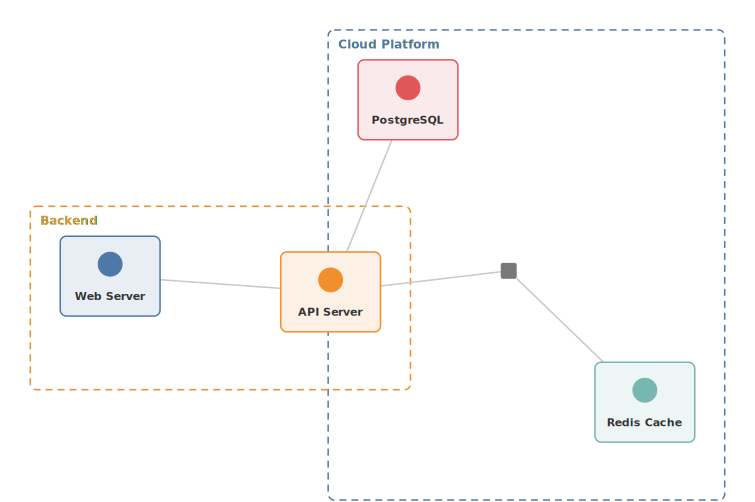

Mermaid source

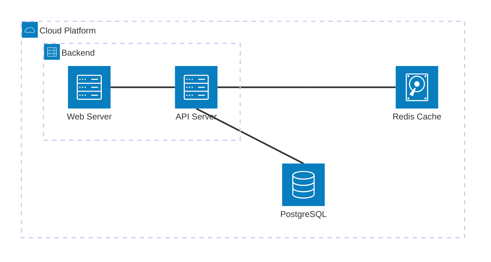
```mermaid
architecture-beta
    group cloud(cloud)[Cloud Platform]
    group backend(server)[Backend] in cloud
    service web(server)[Web Server] in backend
    service api(server)[API Server] in backend
    service db(database)[PostgreSQL] in cloud
    service cache(disk)[Redis Cache] in cloud
    junction mid in cloud
    web:R -- L:api
    api:B -- T:db
    api:R -- L:mid
    mid:R -- L:cache
```

**Syntax notes:**
- Header: `architecture-beta`
- `group NAME(icon)[Label]` creates a container; nest with `in parent`
- `service NAME(icon)[Label]` creates a node; icons: `server`, `database`, `disk`, `cloud`
- `junction NAME` creates a routing point for edge fan-out
- Edges: `source:SIDE -- SIDE:target` where SIDE is `T`, `B`, `L`, `R`

---

## Block

> Grid-based block layout with column spanning, shapes, and edges.

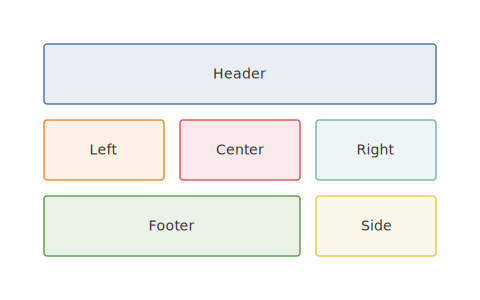

Mermaid source

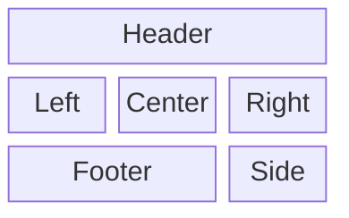
```mermaid
block-beta
  columns 3
  a["Header"]:3
  b["Left"]
  c["Center"]
  d["Right"]
  e["Footer"]:2
  f["Side"]
```

**Syntax notes:**
- Header: `block-beta`
- `columns N` sets the grid width
- `id["Label"]:N` spans N columns
- Shapes: `["Rect"]`, `(("Circle"))`, `{{"Hexagon"}}`, `>"Flag"]`, `(["Stadium"])`, `[/"Parallelogram"/]`, `[("Cylinder")]`
- `space` inserts an empty cell
- Edges between blocks: `a --> b`

---

## C4

> C4 model diagrams (Context, Container, Dynamic) for software architecture.

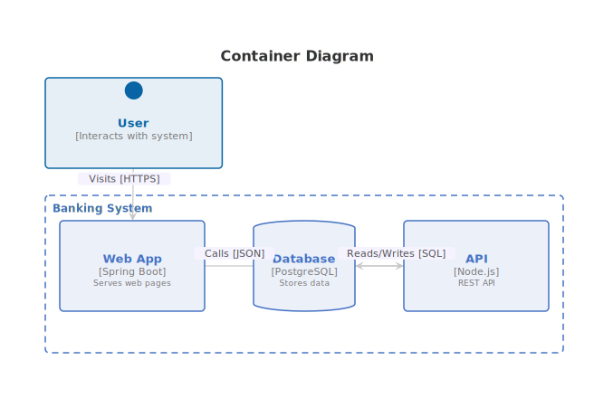

Mermaid source

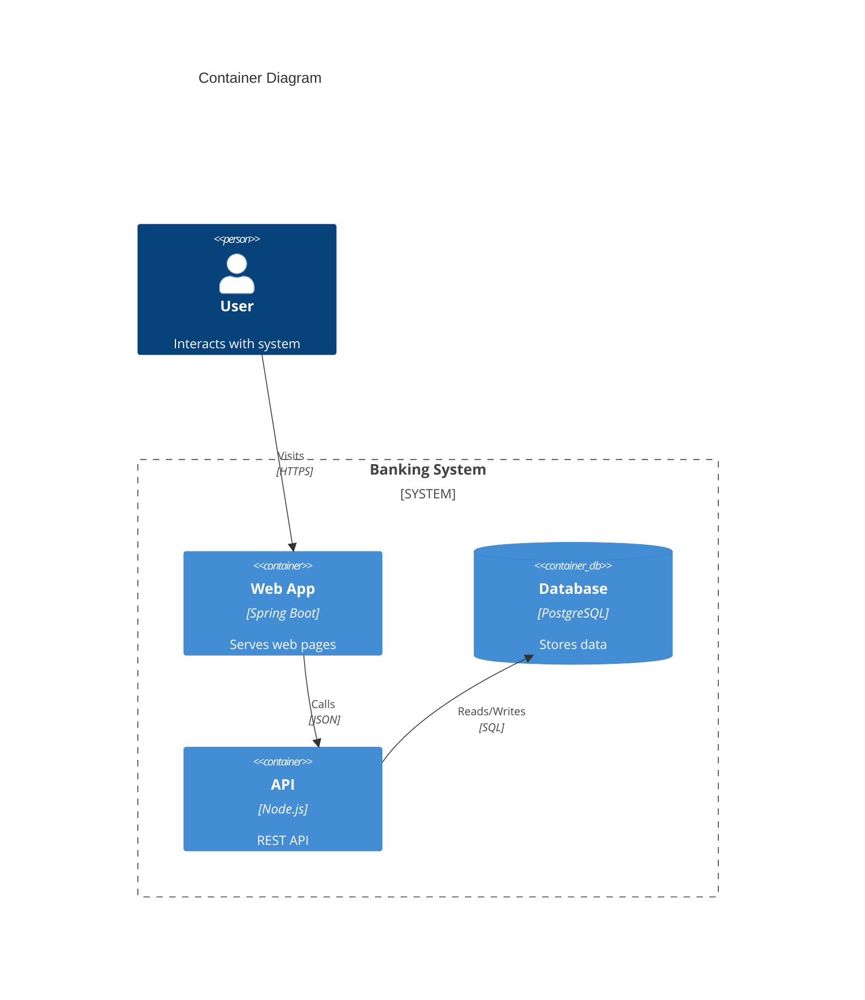
```mermaid
C4Container
  title Container Diagram
  Person(user, "User", "Interacts with system")
  System_Boundary(bank, "Banking System") {
    Container(web, "Web App", "Spring Boot", "Serves web pages")
    ContainerDb(db, "Database", "PostgreSQL", "Stores data")
    Container(api, "API", "Node.js", "REST API")
  }
  Rel(user, web, "Visits", "HTTPS")
  Rel(web, api, "Calls", "JSON")
  Rel(api, db, "Reads/Writes", "SQL")
```

**Syntax notes:**
- Headers: `C4Context`, `C4Container`, `C4Dynamic`
- `Person(id, "label", "description")` for actors
- `Container(id, "label", "technology", "description")` for services; `ContainerDb` for databases
- `System_Boundary(id, "label") { ... }` groups containers
- `Rel(from, to, "label", "technology")` creates relationships

---

## Class

> UML class diagram with members, relationships, cardinality, and annotations.

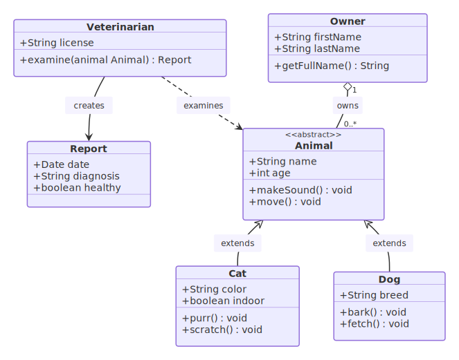

Mermaid source

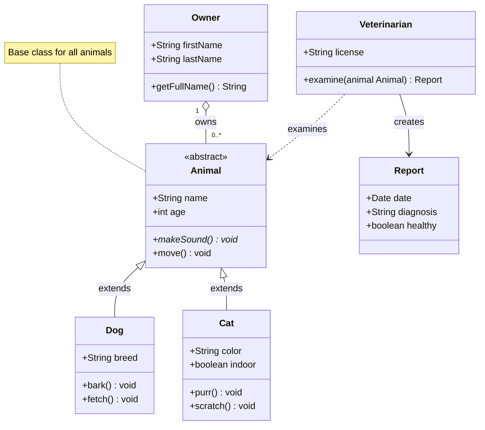
```mermaid
classDiagram
    class Animal {
        <<abstract>>
        +String name
        +int age
        +makeSound()* void
        +move() void
    }
    class Dog {
        +String breed
        +bark() void
        +fetch() void
    }
    class Cat {
        +String color
        +boolean indoor
        +purr() void
        +scratch() void
    }
    class Owner {
        +String firstName
        +String lastName
        +getFullName() String
    }
    class Veterinarian {
        +String license
        +examine(animal Animal) Report
    }
    class Report {
        +Date date
        +String diagnosis
        +boolean healthy
    }
    Animal <|-- Dog : extends
    Animal <|-- Cat : extends
    Owner "1" o-- "0..*" Animal : owns
    Veterinarian ..> Animal : examines
    Veterinarian --> Report : creates
    note for Animal "Base class for all animals"
```

**Syntax notes:**
- Header: `classDiagram`
- Visibility: `+` public, `-` private, `#` protected, `~` package
- Annotations: `<<abstract>>`, `<<interface>>`, `<<enumeration>>`, `<<service>>`
- Relationships: `<|--` inheritance, `o--` aggregation, `*--` composition, `..>` dependency, `-->` association
- Cardinality: `"1" o-- "0..*"` placed before the relationship
- `note for ClassName "text"` attaches a note
- Direction: `direction LR` or `direction TB` (default)
- Generics: `class List~T~`
- Namespaces: `namespace Name { ... }`

---

## ER

> Entity-relationship diagram with attributes, keys, and crow's foot cardinality notation.

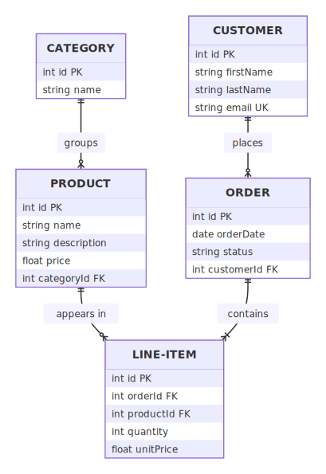

Mermaid source

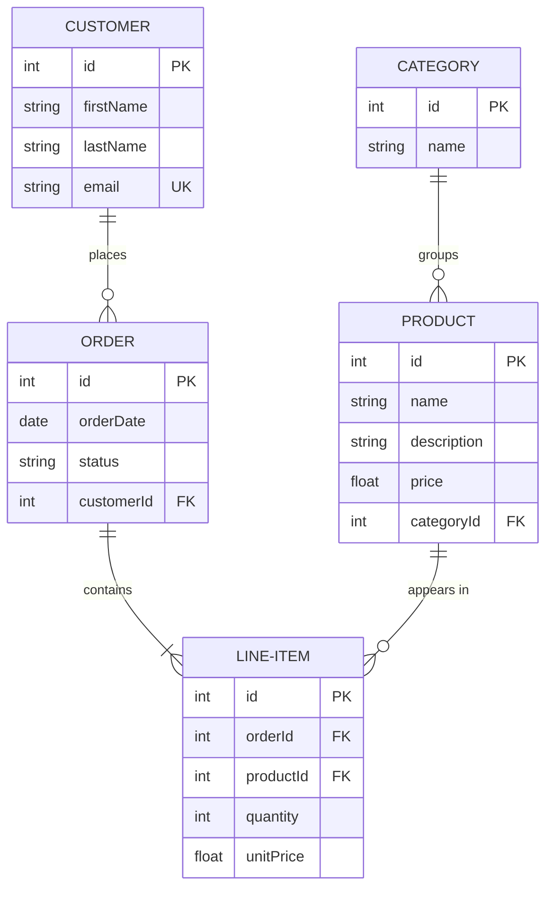
```mermaid
erDiagram
    CUSTOMER {
        int id PK
        string firstName
        string lastName
        string email UK
    }
    ORDER {
        int id PK
        date orderDate
        string status
        int customerId FK
    }
    LINE-ITEM {
        int id PK
        int orderId FK
        int productId FK
        int quantity
        float unitPrice
    }
    PRODUCT {
        int id PK
        string name
        string description
        float price
        int categoryId FK
    }
    CATEGORY {
        int id PK
        string name
    }
    CUSTOMER ||--o{ ORDER : places
    ORDER ||--|{ LINE-ITEM : contains
    PRODUCT ||--o{ LINE-ITEM : "appears in"
    CATEGORY ||--o{ PRODUCT : groups
```

**Syntax notes:**
- Header: `erDiagram`
- Attributes: `type name [PK|FK|UK]` inside entity braces
- Cardinality (crow's foot): `||` exactly one, `o|` zero or one, `}|` one or more, `o{` zero or more
- Identifying: `--` (solid), non-identifying: `..` (dashed)
- Relationship label after `:` (quote multi-word labels)

---

## Flowchart

> General-purpose directed graph with shapes, styled edges, subgraphs, and class definitions.

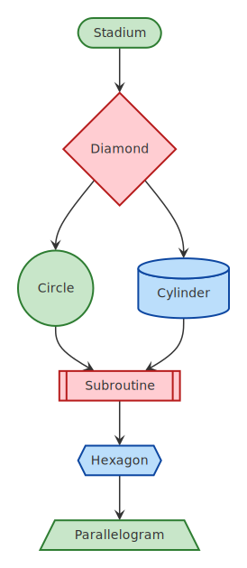

Mermaid source

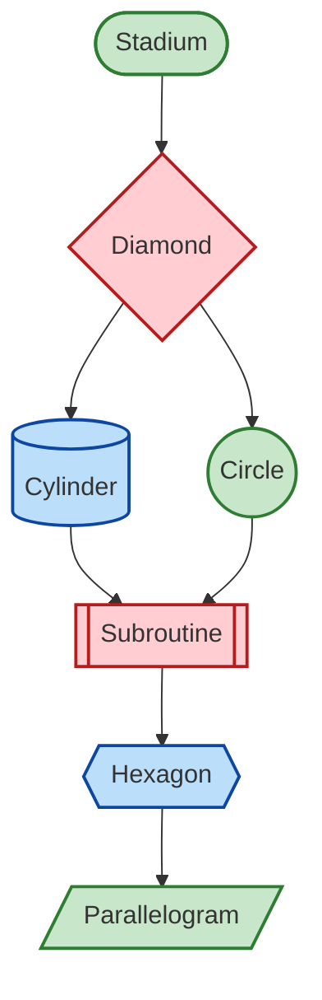
```mermaid
flowchart TD
    A([Stadium]):::green --> B{Diamond}:::red
    B --> C[(Cylinder)]:::blue
    B --> D((Circle)):::green
    C --> E[[Subroutine]]:::red
    D --> E
    E --> F{{Hexagon}}:::blue
    F --> G[/Parallelogram/]:::green

    classDef green fill:#c8e6c9,stroke:#2e7d32,stroke-width:2px
    classDef red fill:#ffcdd2,stroke:#b71c1c,stroke-width:2px
    classDef blue fill:#bbdefb,stroke:#0d47a1,stroke-width:2px
```

**Syntax notes:**
- Header: `flowchart DIRECTION` where DIRECTION is `TB` (top-bottom), `BT`, `LR`, `RL`
- Shapes: `[rect]`, `(rounded)`, `{diamond}`, `([stadium])`, `((circle))`, `[(cylinder)]`, `[[subroutine]]`, `{{hexagon}}`, `[/parallelogram/]`, `[\trapezoid\]`, `>flag]`
- Edges: `-->` arrow, `---` line, `-.->` dotted, `==>` thick; `-->|label|` for edge labels
- Subgraphs: `subgraph title ... end`; subgraphs can set their own `direction`
- `classDef name fill:...,stroke:...` defines a style class; apply with `:::className`
- `style nodeId fill:...` for inline styling
- `linkStyle N stroke:...` styles edge by index

---

## Gantt

> Project timeline with tasks, dependencies, milestones, and status markers.

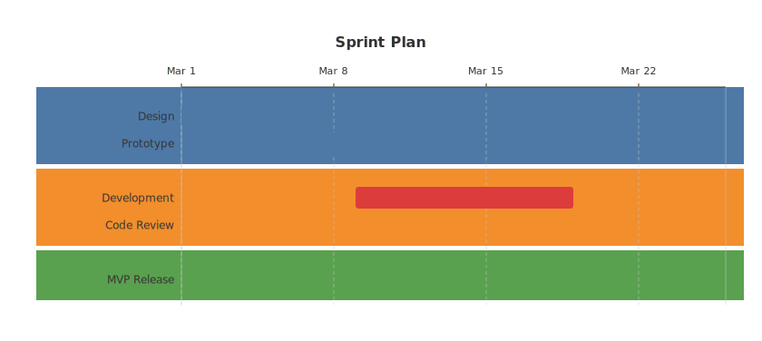

Mermaid source

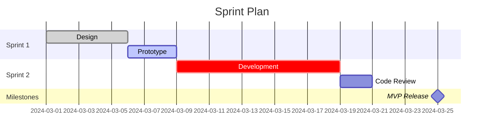
```mermaid
gantt
    title Sprint Plan
    dateFormat YYYY-MM-DD
    section Sprint 1
    Design          :done, des1, 2024-03-01, 5d
    Prototype       :active, proto, after des1, 3d
    section Sprint 2
    Development     :crit, dev1, after proto, 10d
    Code Review     :after dev1, 2d
    section Milestones
    MVP Release     :milestone, 2024-03-25, 0d
```

**Syntax notes:**
- Header: `gantt`
- `dateFormat YYYY-MM-DD` sets the date format
- `section Name` groups tasks
- Task: `Label :tags, id, start, duration`
- Tags: `done`, `active`, `crit` (critical path), `milestone`
- Dependencies: `after taskId` for the start date
- Duration: `5d` (days), `2w` (weeks)

---

## Git Graph

> Git commit history with branches, merges, cherry-picks, and tags.

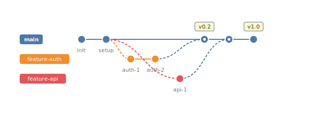

Mermaid source

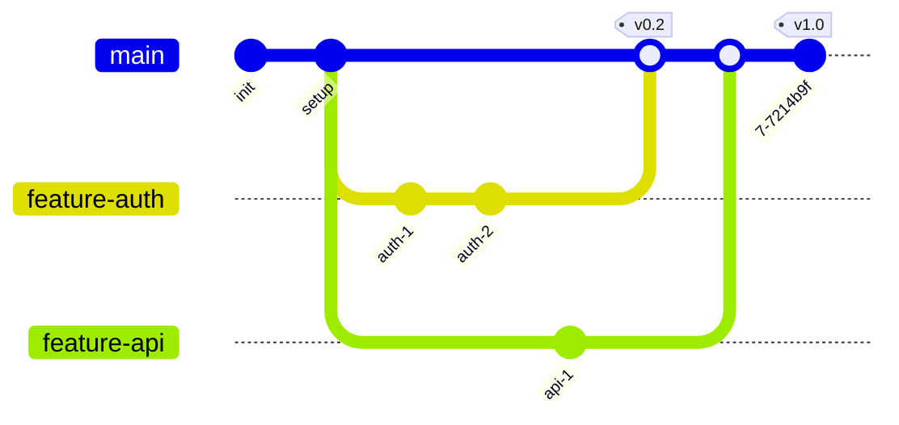
```mermaid
gitGraph
    commit id: "init"
    commit id: "setup"
    branch feature-auth
    commit id: "auth-1"
    commit id: "auth-2"
    checkout main
    branch feature-api
    commit id: "api-1"
    checkout main
    merge feature-auth tag: "v0.2"
    merge feature-api
    commit tag: "v1.0"
```

**Syntax notes:**
- Header: `gitGraph`
- `commit` adds a commit; `id: "label"` names it, `tag: "v1.0"` tags it
- `commit type: HIGHLIGHT` for highlighted commits; types: `NORMAL`, `HIGHLIGHT`, `REVERSE`
- `branch name` creates a branch from current position
- `checkout name` switches to a branch
- `merge branchName` merges into current branch
- `cherry-pick id: "commitId"` cherry-picks a commit

---

## Ishikawa (Fishbone)

> Cause-and-effect (fishbone) diagram for root cause analysis with nested sub-causes.

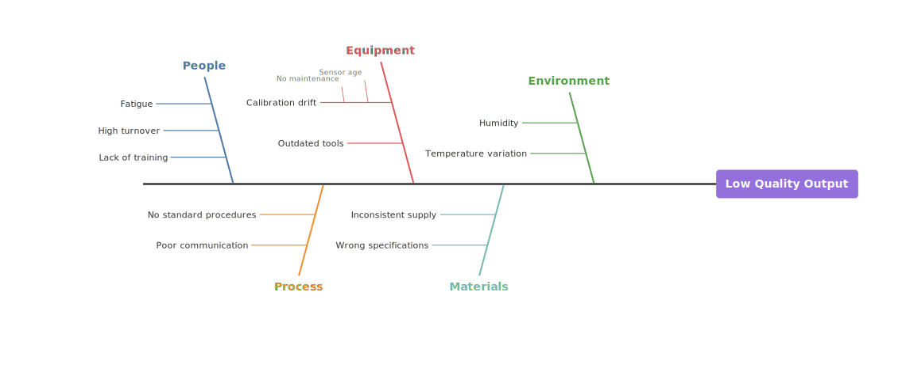

Mermaid source

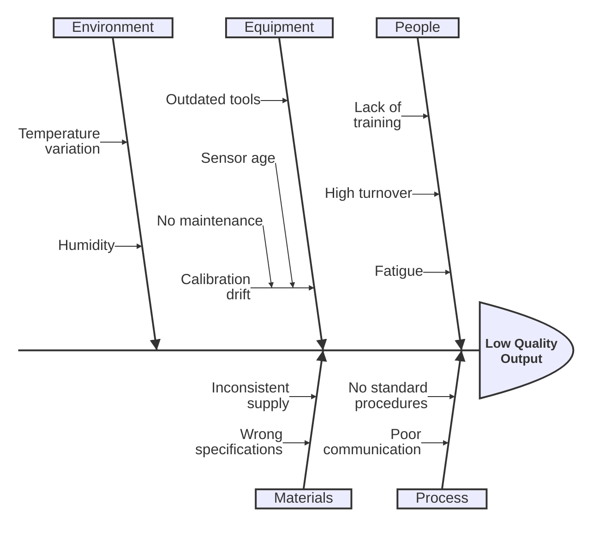
```mermaid
ishikawa-beta
    Low Quality Output
    People
        Lack of training
        High turnover
        Fatigue
    Process
        No standard procedures
        Poor communication
    Equipment
        Outdated tools
        Calibration drift
            Sensor age
            No maintenance
    Materials
        Inconsistent supply
        Wrong specifications
    Environment
        Temperature variation
        Humidity
```

**Syntax notes:**
- Header: `ishikawa-beta`
- First line after header is the effect (head of the fish)
- Top-level indented items are categories (bones)
- Further indented items are causes; deeper indentation creates sub-causes
- Common categories: People, Process, Equipment, Materials, Environment, Management

---

## Journey (User Journey)

> User journey map with tasks scored by satisfaction across sections and actors.

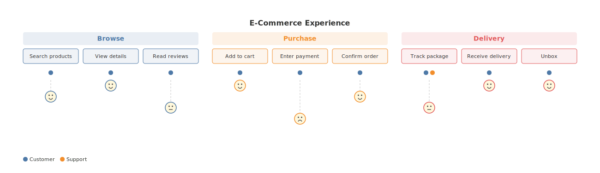

Mermaid source

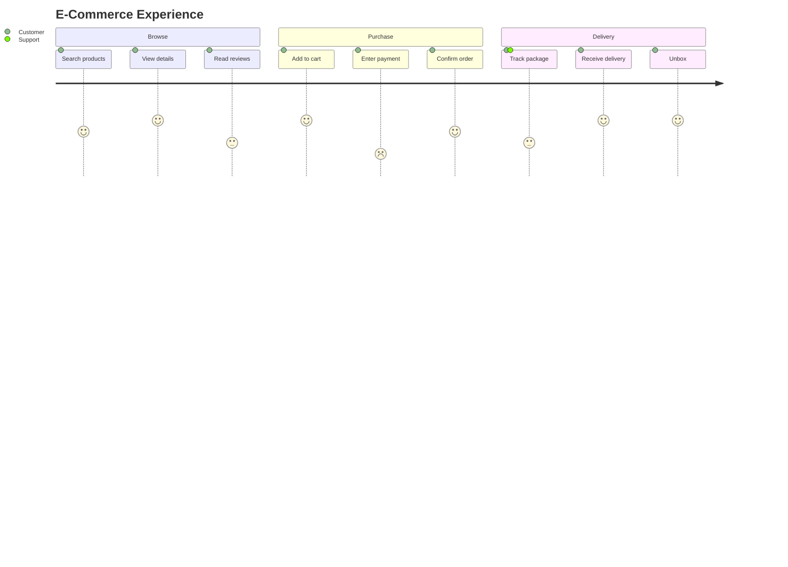
```mermaid
journey
  title E-Commerce Experience
  section Browse
    Search products: 4: Customer
    View details: 5: Customer
    Read reviews: 3: Customer
  section Purchase
    Add to cart: 5: Customer
    Enter payment: 2: Customer
    Confirm order: 4: Customer
  section Delivery
    Track package: 3: Customer, Support
    Receive delivery: 5: Customer
    Unbox: 5: Customer
```

**Syntax notes:**
- Header: `journey`
- `title` sets the diagram title
- `section Name` groups tasks into phases
- Task format: `Task name: score: Actor1, Actor2`
- Scores: `1` (low satisfaction) to `5` (high satisfaction)
- Multiple actors separated by commas

---

## Kanban

> Kanban board with columns, cards, and metadata annotations.

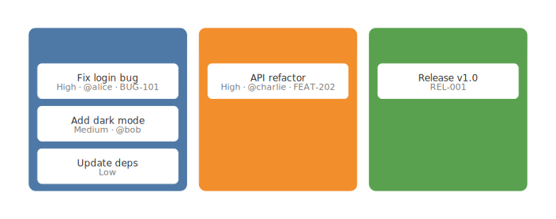

Mermaid source

```mermaid
kanban
    Todo
        t1[Fix login bug] @{priority: high, assigned: alice, ticket: BUG-101}
        t2[Add dark mode] @{priority: medium, assigned: bob}
        t3[Update deps] @{priority: low}
    In Progress
        t4[API refactor] @{priority: high, assigned: charlie, ticket: FEAT-202}
    Done
        t5[Release v1.0] @{ticket: REL-001}
```

**Syntax notes:**
- Header: `kanban`
- Top-level indented items are columns
- Cards: `id[Label]` nested under a column
- Metadata: `@{key: value, key: value}` after the card label
- Common metadata keys: `priority`, `assigned`, `ticket`

---

## Mindmap

> Hierarchical mindmap with different node shapes radiating from a central idea.

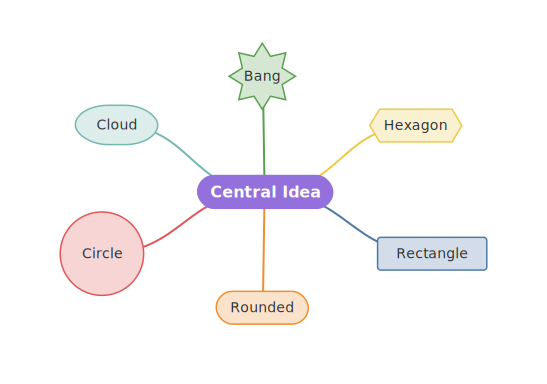

Mermaid source

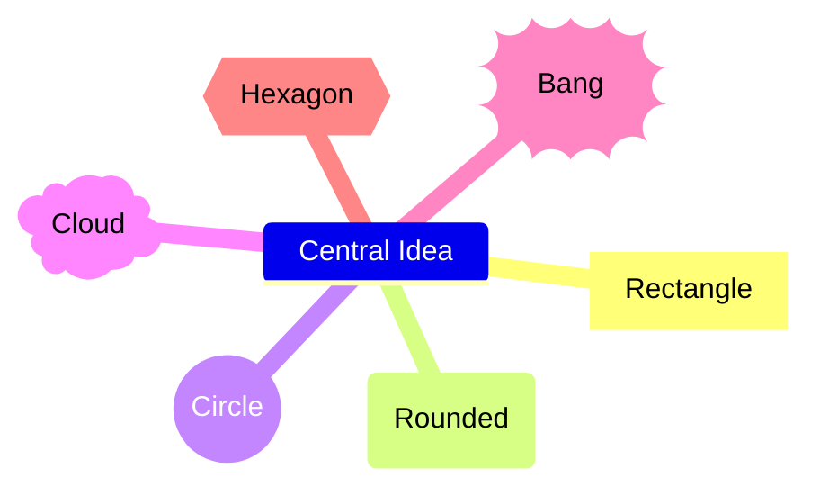
```mermaid
mindmap
    Central Idea
        [Rectangle]
        (Rounded)
        ((Circle))
        )Cloud(
        ))Bang((
        {{Hexagon}}
```

**Syntax notes:**
- Header: `mindmap`
- Root is the first line (plain text = default shape)
- Indentation defines hierarchy
- Shapes: plain text (rectangle), `[Rectangle]`, `(Rounded)`, `((Circle))`, `)Cloud(`, `))Bang((`, `{{Hexagon}}`
- Deeper indentation creates child branches

---

## Packet

> Network packet header layout showing bit-level field positions.

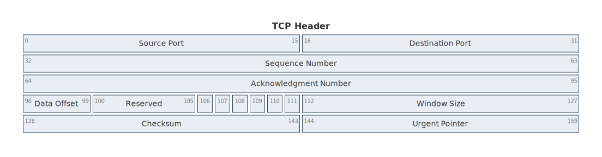

Mermaid source

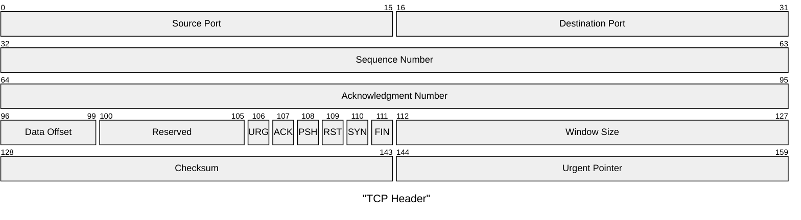
```mermaid
packet-beta
title "TCP Header"
0-15: "Source Port"
16-31: "Destination Port"
32-63: "Sequence Number"
64-95: "Acknowledgment Number"
96-99: "Data Offset"
100-105: "Reserved"
106: "URG"
107: "ACK"
108: "PSH"
109: "RST"
110: "SYN"
111: "FIN"
112-127: "Window Size"
128-143: "Checksum"
144-159: "Urgent Pointer"
```

**Syntax notes:**
- Header: `packet-beta`
- `title "Title"` sets the diagram title
- Field format: `start-end: "Label"` for multi-bit fields, `bit: "Label"` for single-bit fields
- Fields are displayed in 32-bit rows by default
- Bit positions are zero-indexed

---

## Pie

> Pie chart with labeled slices and optional data display.

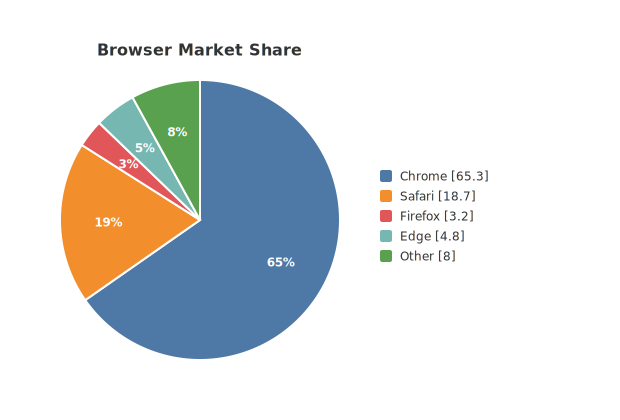

Mermaid source

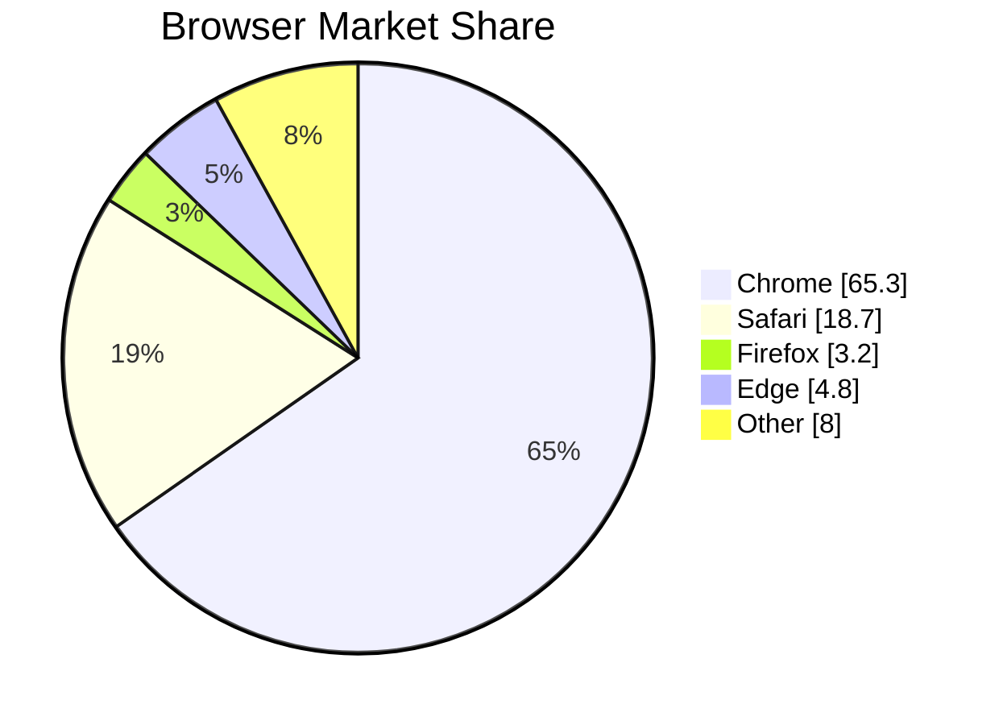
```mermaid
pie showData title Browser Market Share
    "Chrome" : 65.3
    "Safari" : 18.7
    "Firefox" : 3.2
    "Edge" : 4.8
    "Other" : 8.0
```

**Syntax notes:**
- Header: `pie`
- `showData` displays numeric values alongside the chart
- `title Title Text` sets the chart title (on the same line as `pie`)
- Slices: `"Label" : value`
- Values are proportional (they don't need to sum to 100)

---

## Quadrant

> Four-quadrant chart with labeled axes, named quadrants, and positioned data points.

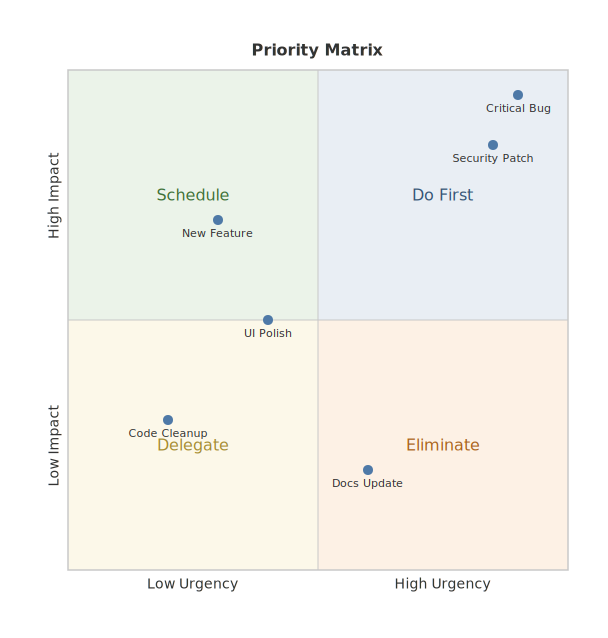

Mermaid source

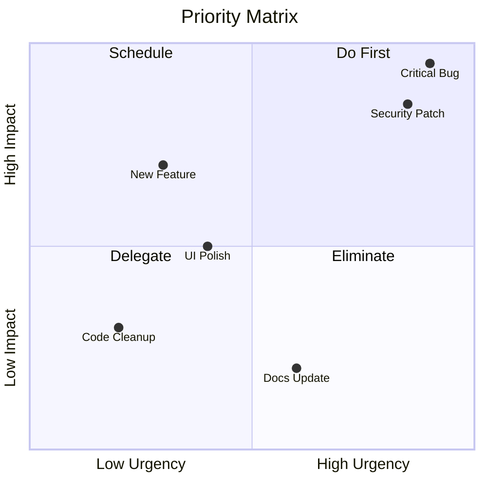
```mermaid
quadrantChart
  title Priority Matrix
  x-axis Low Urgency --> High Urgency
  y-axis Low Impact --> High Impact
  quadrant-1 Do First
  quadrant-2 Schedule
  quadrant-3 Delegate
  quadrant-4 Eliminate
  Critical Bug: [0.9, 0.95]
  New Feature: [0.3, 0.7]
  Code Cleanup: [0.2, 0.3]
  Docs Update: [0.6, 0.2]
  Security Patch: [0.85, 0.85]
  UI Polish: [0.4, 0.5]
```

**Syntax notes:**
- Header: `quadrantChart`
- `x-axis Low --> High` and `y-axis Low --> High` label the axes
- `quadrant-1` through `quadrant-4` name each quadrant (1 = top-right, 2 = top-left, 3 = bottom-left, 4 = bottom-right)
- Points: `Label: [x, y]` where x and y are 0.0 to 1.0

---

## Radar

> Radar (spider) chart comparing multiple datasets across shared axes.

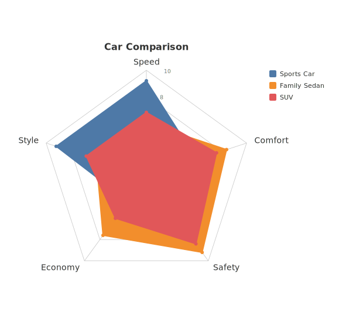

Mermaid source

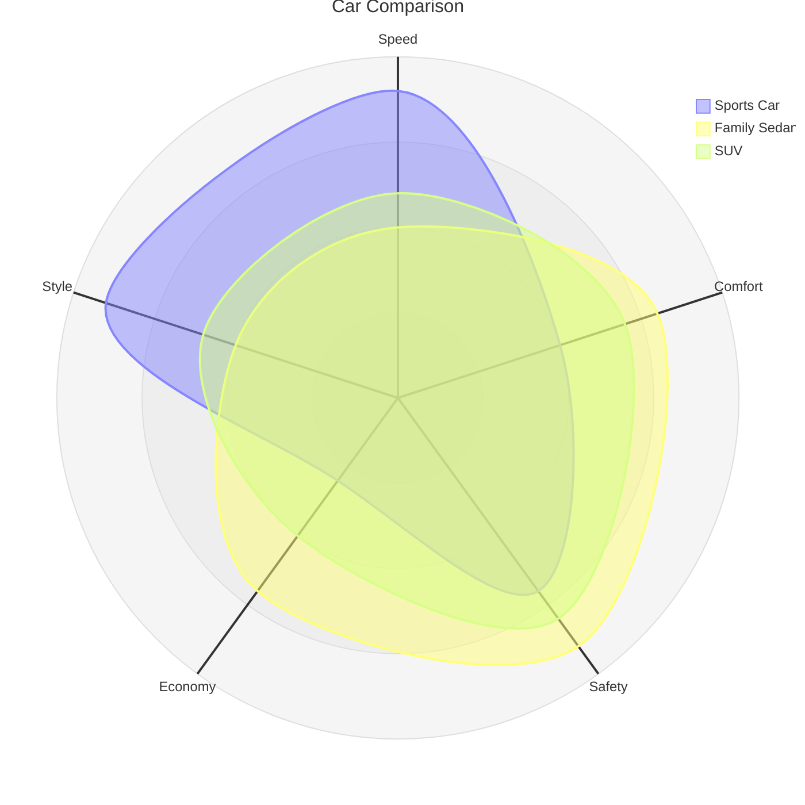
```mermaid
radar-beta
title Car Comparison
ticks 4
max 10
axis Speed,Comfort,Safety,Economy,Style
curve sportsCar["Sports Car"]{9,5,7,3,9}
curve sedan["Family Sedan"]{5,8,9,7,5}
curve suv["SUV"]{6,7,8,5,6}
```

**Syntax notes:**
- Header: `radar-beta`
- `ticks N` sets the number of concentric grid rings
- `max N` sets the maximum axis value
- `axis Name1,Name2,...` defines the axes (determines polygon shape -- 5 axes = pentagon)
- `curve id["Label"]{v1,v2,...}` adds a data series; values correspond to axes in order

---

## Requirement

> Requirements diagram with typed requirements, design constraints, elements, and traceability relationships.

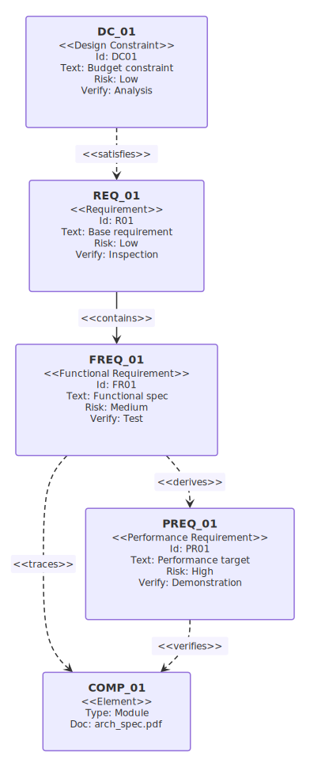

Mermaid source

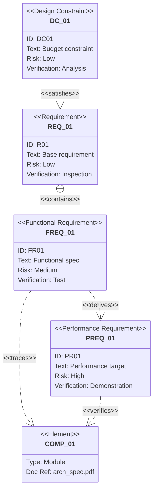
```mermaid
requirementDiagram

    requirement REQ_01 {
        id: R01
        text: "Base requirement"
        risk: low
        verifymethod: inspection
    }

    functionalRequirement FREQ_01 {
        id: FR01
        text: "Functional spec"
        risk: medium
        verifymethod: test
    }

    performanceRequirement PREQ_01 {
        id: PR01
        text: "Performance target"
        risk: high
        verifymethod: demonstration
    }

    designConstraint DC_01 {
        id: DC01
        text: "Budget constraint"
        risk: low
        verifymethod: analysis
    }

    element COMP_01 {
        type: Module
        docref: "arch_spec.pdf"
    }

    REQ_01 - contains -> FREQ_01
    FREQ_01 - derives -> PREQ_01
    DC_01 - satisfies -> REQ_01
    COMP_01 <- traces - FREQ_01
    PREQ_01 - verifies -> COMP_01
```

**Syntax notes:**
- Header: `requirementDiagram`
- Requirement types: `requirement`, `functionalRequirement`, `performanceRequirement`, `interfaceRequirement`, `physicalRequirement`, `designConstraint`
- Properties: `id`, `text`, `risk` (`low`/`medium`/`high`), `verifymethod` (`inspection`/`test`/`demonstration`/`analysis`)
- `element NAME { type: ..., docref: ... }` represents a system component
- Relationships: `A - type -> B` or `A <- type - B`; types: `contains`, `derives`, `satisfies`, `traces`, `verifies`, `refines`, `copies`

---

## Sankey

> Sankey flow diagram showing weighted flows between nodes as a CSV-like format.

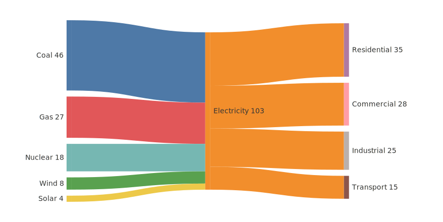

Mermaid source

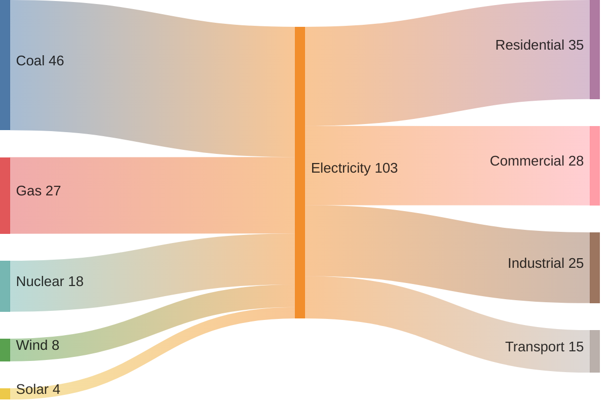
```mermaid
sankey-beta
Coal,Electricity,46
Gas,Electricity,27
Nuclear,Electricity,18
Wind,Electricity,8
Solar,Electricity,4
Electricity,Residential,35
Electricity,Commercial,28
Electricity,Industrial,25
Electricity,Transport,15
```

**Syntax notes:**
- Header: `sankey-beta`
- Each line: `Source,Target,Value` (CSV format)
- Nodes are created implicitly from source/target names
- A node can be both a source and a target (for multi-stage flows)
- Quote node names that contain commas: `"Node, with comma",Target,10`

---

## Sequence

> Sequence diagram with actors, messages, notes, activation bars, and control-flow fragments (loop, alt, par).

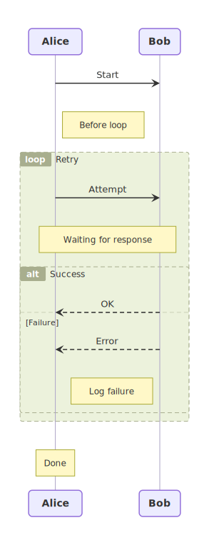

Mermaid source

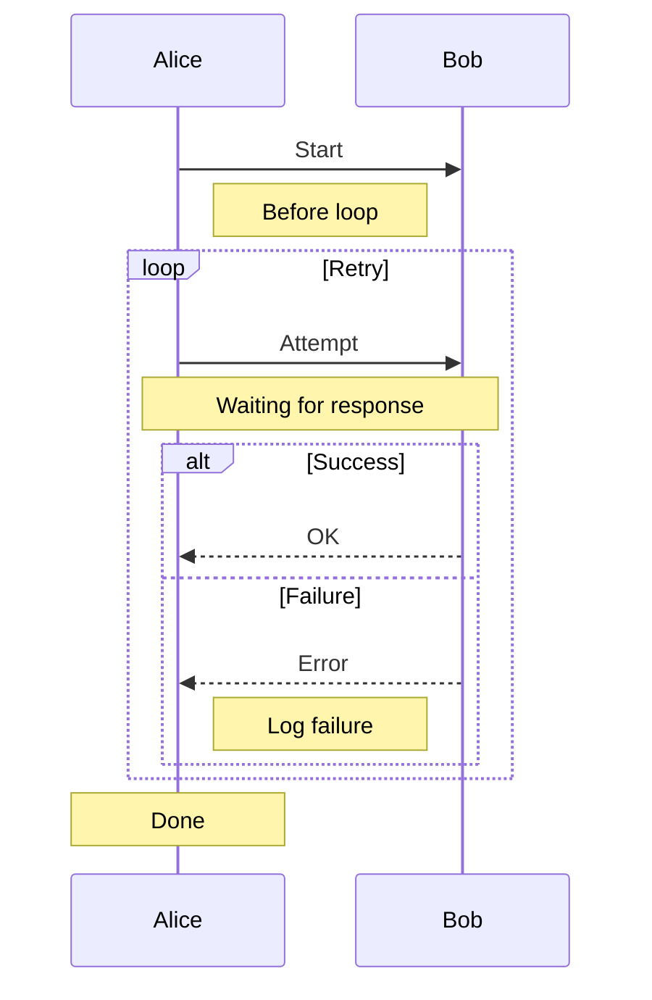
```mermaid
sequenceDiagram
    Alice->>Bob: Start
    Note right of Alice: Before loop
    loop Retry
        Alice->>Bob: Attempt
        Note over Alice,Bob: Waiting for response
        alt Success
            Bob-->>Alice: OK
        else Failure
            Bob-->>Alice: Error
            Note left of Bob: Log failure
        end
    end
    Note over Alice: Done
```

**Syntax notes:**
- Header: `sequenceDiagram`
- Participants: `participant Name` or `actor Name` (stick figure)
- Messages: `->>` solid arrow, `-->>` dashed, `-x` lost message, `-)` async
- Activation: `activate`/`deactivate`, or shorthand `+`/`-` on arrows (`->>+` activates, `-->>-` deactivates)
- Notes: `Note right of A:`, `Note left of A:`, `Note over A,B:`
- Fragments: `loop`, `alt`/`else`, `opt`, `par`/`and`, `critical`/`option`, `break`
- `autonumber` enables automatic message numbering

---

## State

> UML state diagram with composite states, concurrent regions, forks/joins, choices, and notes.

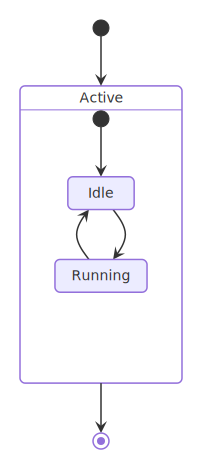

Mermaid source

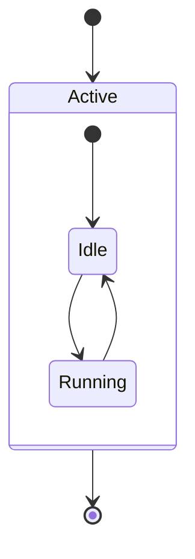
```mermaid
stateDiagram-v2
    [*] --> Active
    state Active {
        [*] --> Idle
        Idle --> Running
        Running --> Idle
    }
    Active --> [*]
```

**Syntax notes:**
- Header: `stateDiagram-v2` (or `stateDiagram`)
- `[*]` is the start/end pseudo-state
- Transitions: `State1 --> State2 : label`
- Composite states: `state Name { ... }` nests sub-states
- Concurrent regions: `--` separator inside a composite state
- Fork/join: `state forkName <<fork>>`, `state joinName <<join>>`
- Choice: `state choiceName <<choice>>`
- Notes: `note right of State : text` or `note left of State : text`
- Styling: `classDef` and `class StateName className`
- Direction: `direction LR` or `direction TB`

---

## Timeline

> Chronological timeline with titled sections and multiple events per time period.

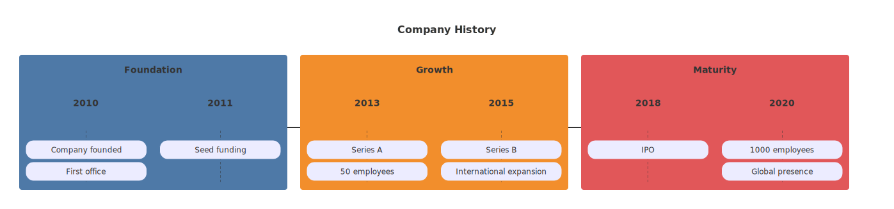

Mermaid source

```mermaid
timeline
    title Company History
    section Foundation
        2010 : Company founded : First office
        2011 : Seed funding
    section Growth
        2013 : Series A : 50 employees
        2015 : Series B : International expansion
    section Maturity
        2018 : IPO
        2020 : 1000 employees : Global presence
```

**Syntax notes:**
- Header: `timeline`
- `title` sets the diagram title
- `section Name` groups time periods
- Entry format: `Period : Event1 : Event2 : ...`
- Multiple events per period separated by `:`

---

## Treemap

> Proportional area treemap with hierarchical grouping and weighted leaf nodes.

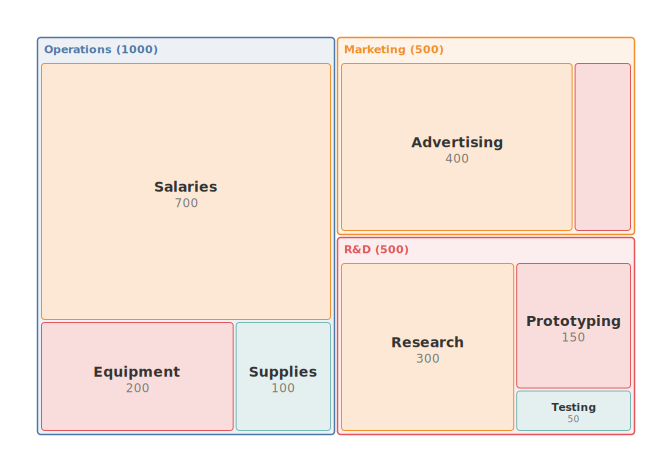

Mermaid source

```mermaid
treemap
    Operations
        Salaries: 700
        Equipment: 200
        Supplies: 100
    Marketing
        Advertising: 400
        Events: 100
    R&D
        Research: 300
        Prototyping: 150
        Testing: 50
```

**Syntax notes:**
- Header: `treemap`
- Indentation defines hierarchy
- Leaf nodes: `Label: value` (value determines area)
- Parent nodes are labels only (their area is the sum of children)

---

## Treeview

> File-tree / org-chart style hierarchical list rendered with tree connectors.

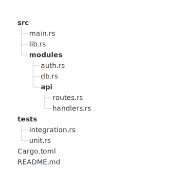

Mermaid source

```mermaid
treeView-beta
    src
        main.rs
        lib.rs
        modules
            auth.rs
            db.rs
            api
                routes.rs
                handlers.rs
    tests
        integration.rs
        unit.rs
    Cargo.toml
    README.md
```

**Syntax notes:**
- Header: `treeView-beta`
- Indentation defines parent-child hierarchy
- Leaf and branch nodes are plain text
- Renders with ASCII-style tree connectors

---

## Venn

> Venn diagram with labeled sets, set sizes, and intersection regions.

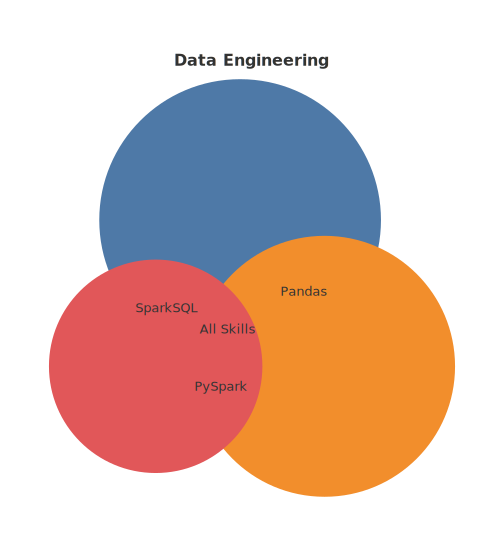

Mermaid source

```mermaid
venn-beta
    title Data Engineering
    set A["SQL"]:35
    set B["Python"]:30
    set C["Spark"]:20
    union A,B["Pandas"]:12
    union B,C["PySpark"]:10
    union A,C["SparkSQL"]:8
    union A,B,C["All Skills"]:5
```

**Syntax notes:**
- Header: `venn-beta`
- `title` sets the diagram title
- `set ID["Label"]:size` defines a circle
- `union ID1,ID2["Label"]:size` defines an intersection region
- Supports 2 to 5 sets
- Intersection labels and sizes are optional

---

## XY Chart

> Bar and line chart with categorical or numeric axes.

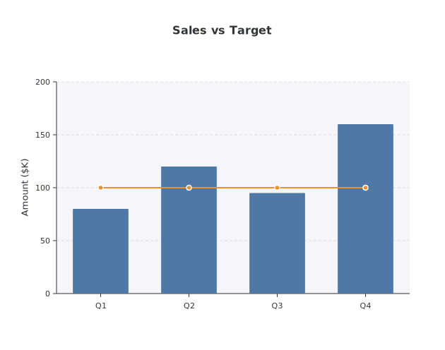

Mermaid source

```mermaid
xychart-beta
    title "Sales vs Target"
    x-axis [Q1, Q2, Q3, Q4]
    y-axis "Amount ($K)" 0 --> 200
    bar "Actual" [80, 120, 95, 160]
    line "Target" [100, 100, 100, 100]
```

**Syntax notes:**
- Header: `xychart-beta`
- `title "Title"` sets the chart title
- `x-axis [Cat1, Cat2, ...]` for categorical, or `x-axis "Label" min --> max` for numeric
- `y-axis "Label" min --> max` sets the y-axis range
- `bar "Series" [v1, v2, ...]` adds a bar series
- `line "Series" [v1, v2, ...]` adds a line series
- Multiple series can be mixed (bars and lines together)
